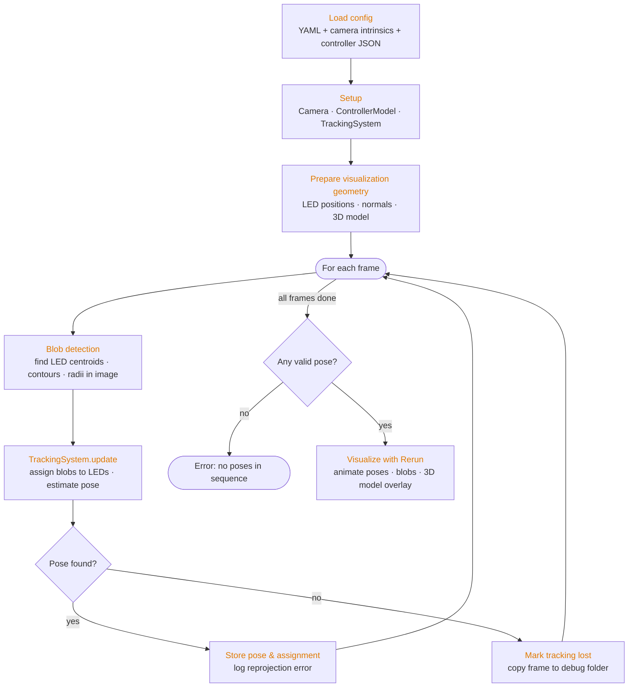
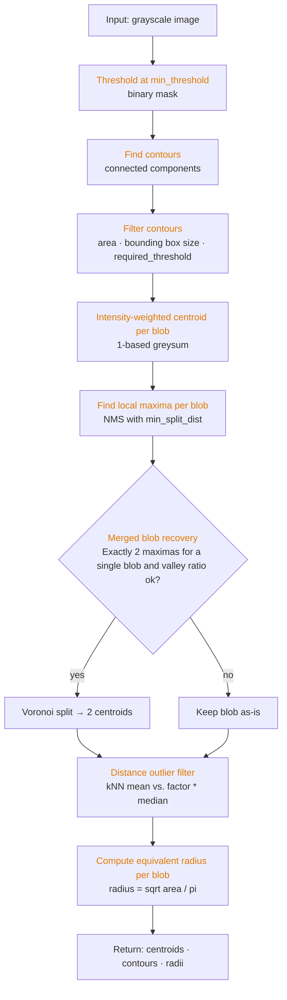
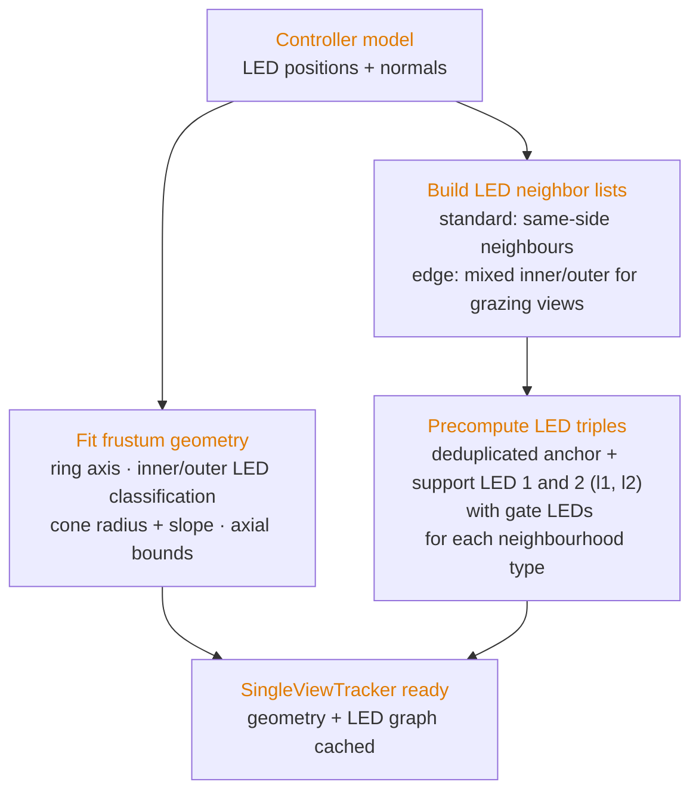
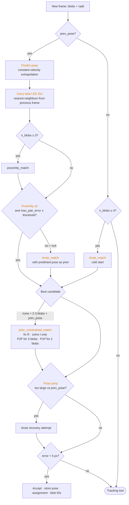
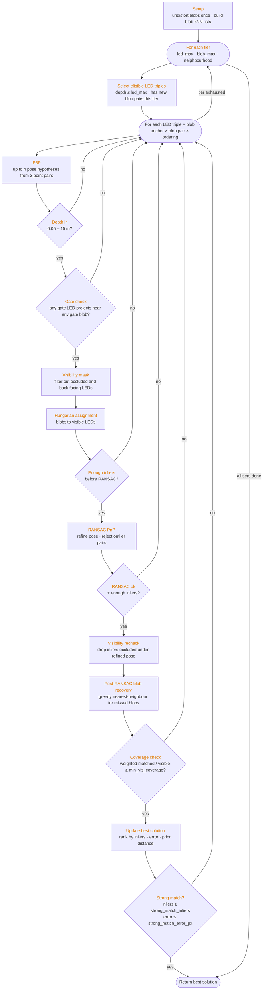
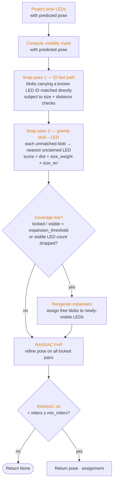
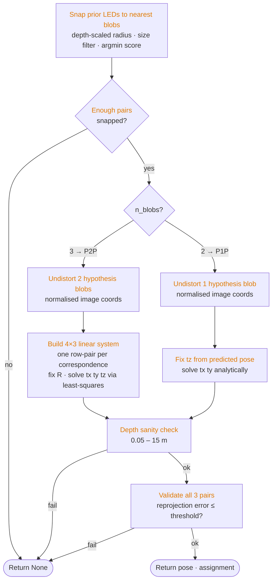

# Algorithm Overview

---

## Blob Detection

---

## Tracker Initialization (`SingleViewTracker.__init__`)

Run once at startup from the fixed controller model. All results are cached for the lifetime of the tracker.

## Per-frame Tracking State Machine (`track`)

Decides which solver to call based on available state.

---

## Brute-force Matching (`brute_match`)

Used on first acquisition or after tracking loss — no prior pose available.

---

## Proximity Match (`proximity_match`)

Fast path used every frame when a prior pose is available. Projects previous LEDs forward with the predicted pose, then snaps current blobs to them.

---

## Prior-constrained Match (`prior_constrained_match`)

Fallback when only 2–3 blobs are visible — too few for P3P or RANSAC. Fixes rotation from the predicted pose as a hard constraint and collapses the problem to translation-only.

