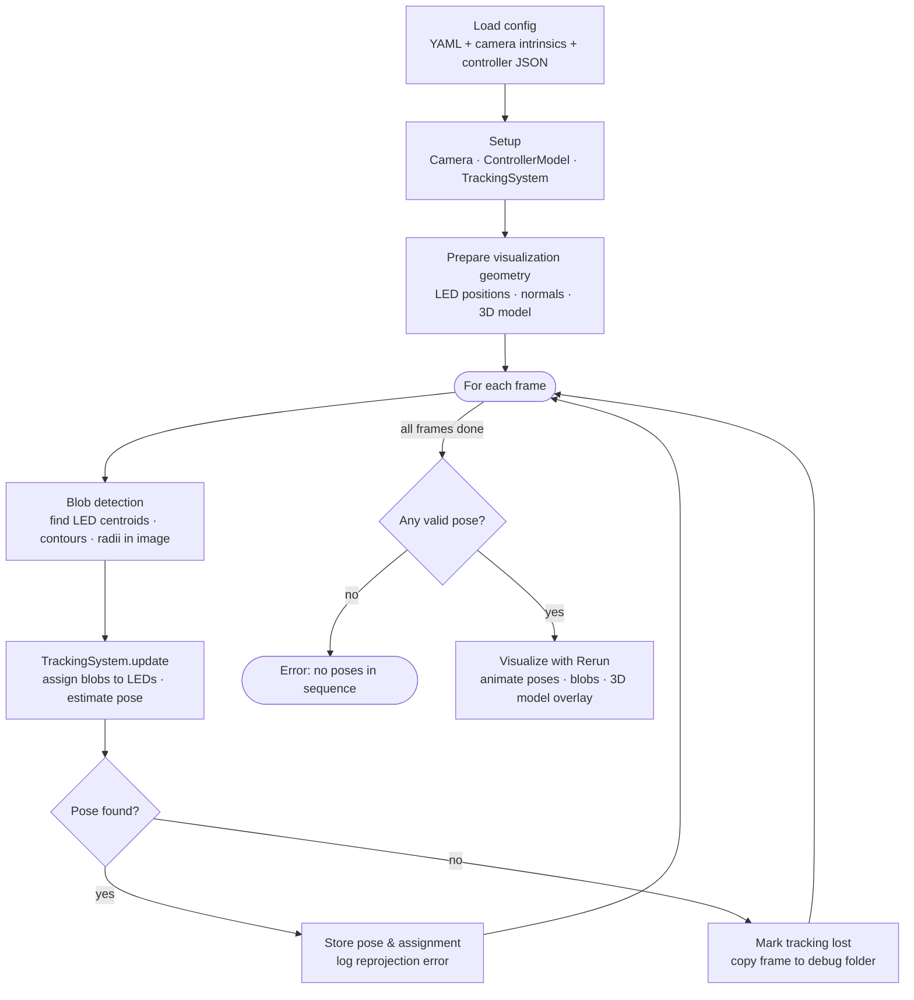
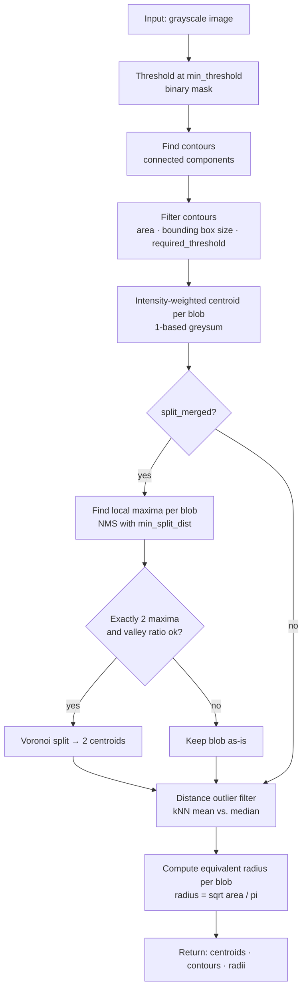
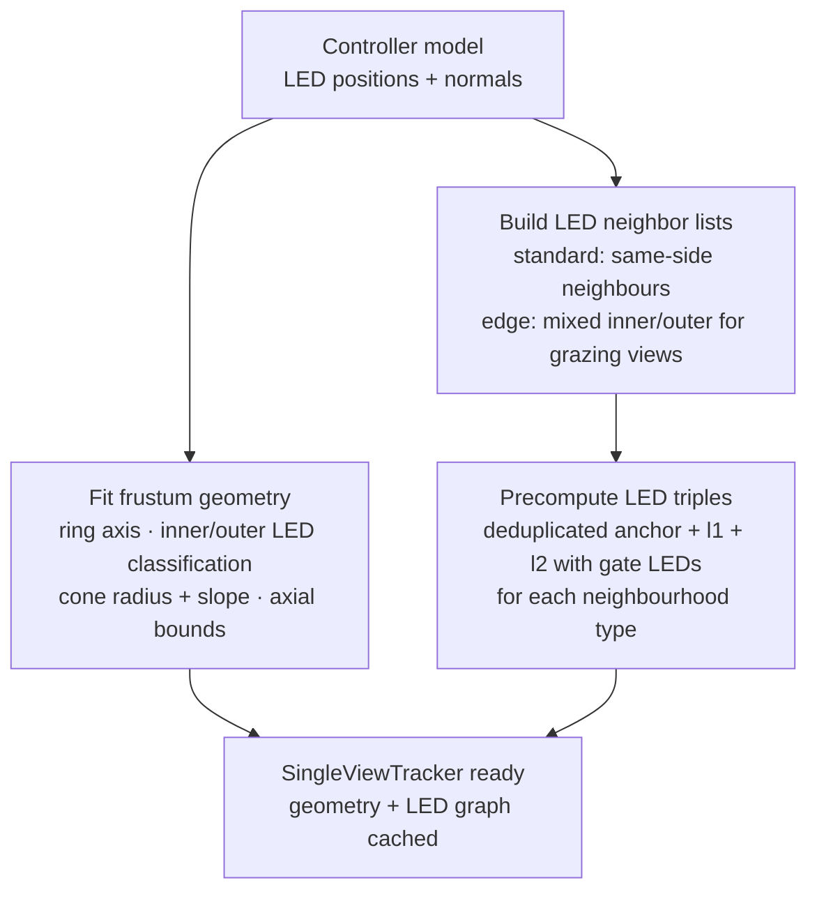
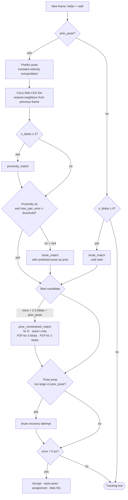
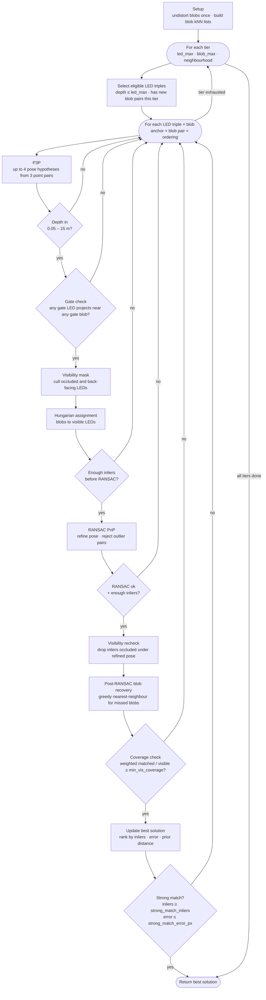
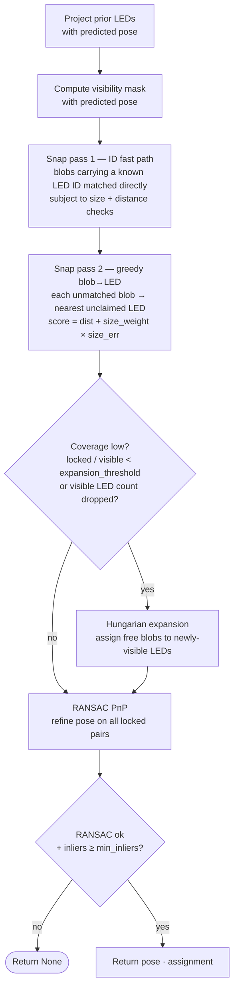
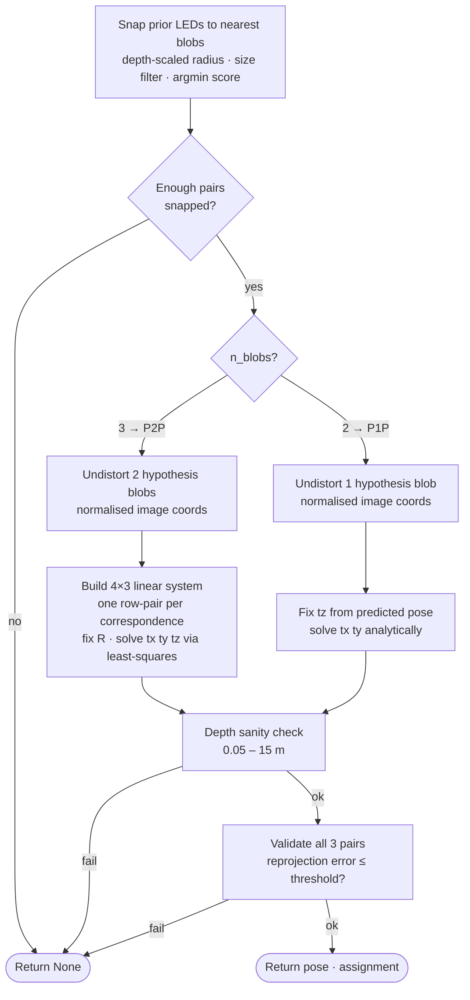

# Algorithm Overview

---

## Blob Detection

---

## Tracker Initialization (`SingleViewTracker.__init__`)

Run once at startup from the fixed controller model. All results are cached for the lifetime of the tracker.

**Tracker state** — maintained across frames, cleared on tracking loss:

| field | what it holds | cleared on loss? |
|---|---|---|
| `prev_pose` | rvec + tvec from the last accepted frame | yes |
| `prev_prev_pose` | frame before that; used for velocity extrapolation | yes |
| `prev_assignment` | LED–blob pairs from the last accepted frame | yes |
| `last_good_pose` | last accepted pose; **kept across loss** for re-acquisition plausibility | no |
| `prev_blob_positions` | blob pixel positions from previous frame | yes |
| `prev_blob_led_ids` | LED ID carried by each previous blob; feeds the ID fast path in proximity_match | yes |

**Constant-velocity pose prediction** — when two consecutive prior poses exist, the next pose is extrapolated before passing to any solver:
- Translation: `t_{n+1} = 2·t_n − t_{n−1}`
- Rotation: `R_{n+1} = (R_n · R_{n−1}ᵀ) · R_n` (apply the same delta rotation again)

---

## Per-frame Tracking State Machine (`track`)

Decides which solver to call based on available state.

---

## Brute-force Matching (`brute_match`)

Used on first acquisition or after tracking loss — no prior pose available.

---

## Proximity Match (`proximity_match`)

Fast path used every frame when a prior pose is available. Projects previous LEDs forward with the predicted pose, then snaps current blobs to them.

---

## Prior-constrained Match (`prior_constrained_match`)

Fallback when only 2–3 blobs are visible — too few for P3P or RANSAC. Fixes rotation from the predicted pose as a hard constraint and collapses the problem to translation-only.

